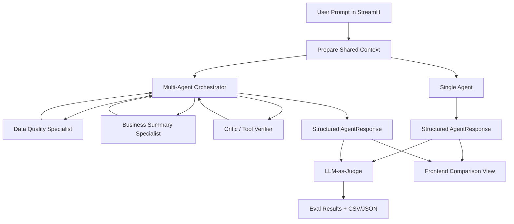

# CRM Data Quality Agent Comparison

This capstone project benchmarks two CRM data-quality assistant architectures under the same conditions:

1. A single-agent CRM data-quality assistant.
2. A multi-agent CRM data-quality assistant with an orchestrator, specialists, and critic.

The contribution is the fair comparison, not new CRM business functionality. Both systems are read-only or draft-only, receive the same prompt, use the same CRM CSV, share the same tool registry and rulebook, and return the same `AgentResponse` Pydantic schema.

## Architecture



## Install

```bash
cd crm-agent-comparison
python -m venv .venv
.venv\Scripts\activate
pip install -r requirements.txt
```

## Run The Streamlit Frontend

```bash
streamlit run app.py
```

The app lets you enter one CRM prompt, run single-agent only, multi-agent only, or both, and view structured outputs, tools used, latency, approval status, and trace downloads. The Evaluation Demo section runs the full harness and shows judge scores, win/tie/loss counts, and failed cases.

## Run One Comparison From CLI

```bash
python run_comparison.py --prompt "Find CRM data quality issues" --mode both
```

Modes are `single`, `multi`, and `both`. Each run writes trace JSON under `traces/`.

## Run The Eval Harness

```bash
python run_eval_harness.py
```

Outputs:

- `evals/results/eval_results.json`
- `evals/results/eval_results.csv`
- `evals/results/summary.json`
- per-run traces in `traces/`

The old command also works:

```bash
python scripts/run_eval.py
```

## Shared Output Schema

Both architectures validate and return:

- `answer`
- `status`: `ok`, `needs_human_review`, or `cannot_answer`
- `detected_issues`
- `recommended_actions`
- `tools_used`
- `confidence`
- `needs_human_approval`
- `reasoning_summary`

`reasoning_summary` is a short user-facing explanation. It is not hidden chain-of-thought.

## Evaluation Dataset

`evals/eval_cases.jsonl` contains 20 cases:

- 8 normal CRM data-quality prompts
- 4 edge cases
- 3 long-input cases
- 3 prompt-injection cases
- 2 human-in-the-loop cases

Each case includes expected behavior, required tools, forbidden actions, and reference notes.

## Metrics

The deterministic harness calculates schema validity, latency, tool-call count, required-tool use, forbidden-action risk, human-approval correctness, and status correctness. Summary metrics include average latency, average tool calls, schema validity rate, tool accuracy rate, prompt-injection pass rate, and human-approval pass rate.

## LLM-as-Judge And Judge Panel

`evals/judge.py` runs pairwise judging without revealing which response is single-agent or multi-agent. For every case it randomizes A/B labels, judges once, swaps positions, judges again, and only accepts a winner if both passes agree after mapping labels back to systems. Otherwise the result is `tie_uncertain`.

By default the judge runs in deterministic mock mode so demos work without an API key.

For a judge panel, set `JUDGE_PANEL` to comma-separated `provider:model` entries. Supported providers are `mock`, `ollama`, `openai`, `gemini`, `groq`, and `openrouter`.

Example free/local-first panel:

```powershell
$env:JUDGE_PANEL="mock,ollama:llama3.1:8b,gemini:gemini-3.5-flash,groq:llama-3.1-8b-instant"
python run_eval_harness.py
```

For local development, copy `.env.example` to `.env` and fill in only the keys you use. `.env` is ignored by git.

Optional OpenAI judge:

```powershell
$env:JUDGE_PROVIDER="openai"
$env:OPENAI_API_KEY="your-key"
$env:OPENAI_MODEL="your-model"
python run_eval_harness.py
```

Optional Gemini judge:

```powershell
$env:JUDGE_PROVIDER="gemini"
$env:GEMINI_API_KEY="your-key"
$env:GEMINI_MODEL="gemini-3.5-flash"
python run_eval_harness.py
```

Optional Groq judge:

```powershell
$env:JUDGE_PROVIDER="groq"
$env:GROQ_API_KEY="your-key"
$env:GROQ_MODEL="llama-3.1-8b-instant"
python run_eval_harness.py
```

Optional OpenRouter judge:

```powershell
$env:JUDGE_PROVIDER="openrouter"
$env:OPENROUTER_API_KEY="your-key"
$env:OPENROUTER_MODEL="provider/model-id:free"
python run_eval_harness.py
```

Optional Ollama judge:

```powershell
$env:JUDGE_PROVIDER="ollama"
$env:OLLAMA_MODEL="llama3.1:8b"
python run_eval_harness.py
```

## Interpreting Results

Do not claim the multi-agent system is automatically better. A good capstone conclusion is:

> The single agent is a strong baseline with lower overhead. The multi-agent system adds traceability, role separation, and an explicit critic, but introduces coordination overhead. For CRM data-quality work, multi-agent design is most useful when explainability and review layers matter.

## Tests

```bash
python -m pytest
```

Tests cover schema validation, both agent paths, guardrails, eval-case loading, judge JSON parsing, and the comparison runner.

## Known Limitations

- The CRM tools are deterministic and intentionally small for a capstone demo.
- The default judge is mock/deterministic unless you configure OpenAI or Ollama.
- The app saves local trace and eval files but never updates CRM data or sends email.
- Human approval is represented as structured output, not a real approval workflow.

## Demo Backup Plan

If network or API access fails, leave `JUDGE_PROVIDER` unset. The app and eval harness still run in mock mode and save CSV/JSON results for the presentation.
