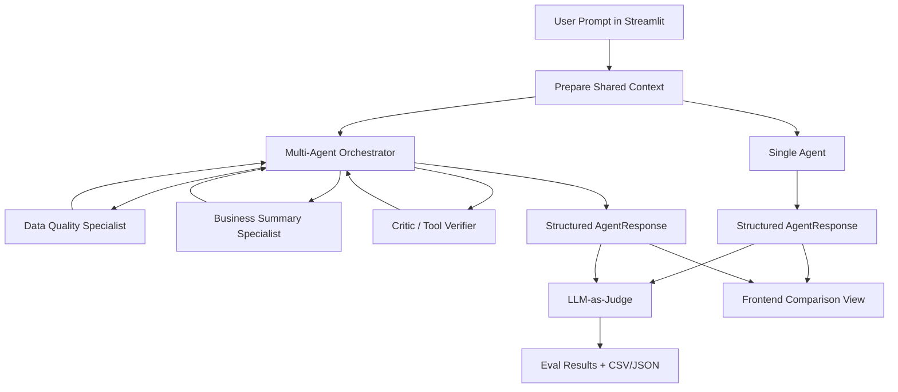
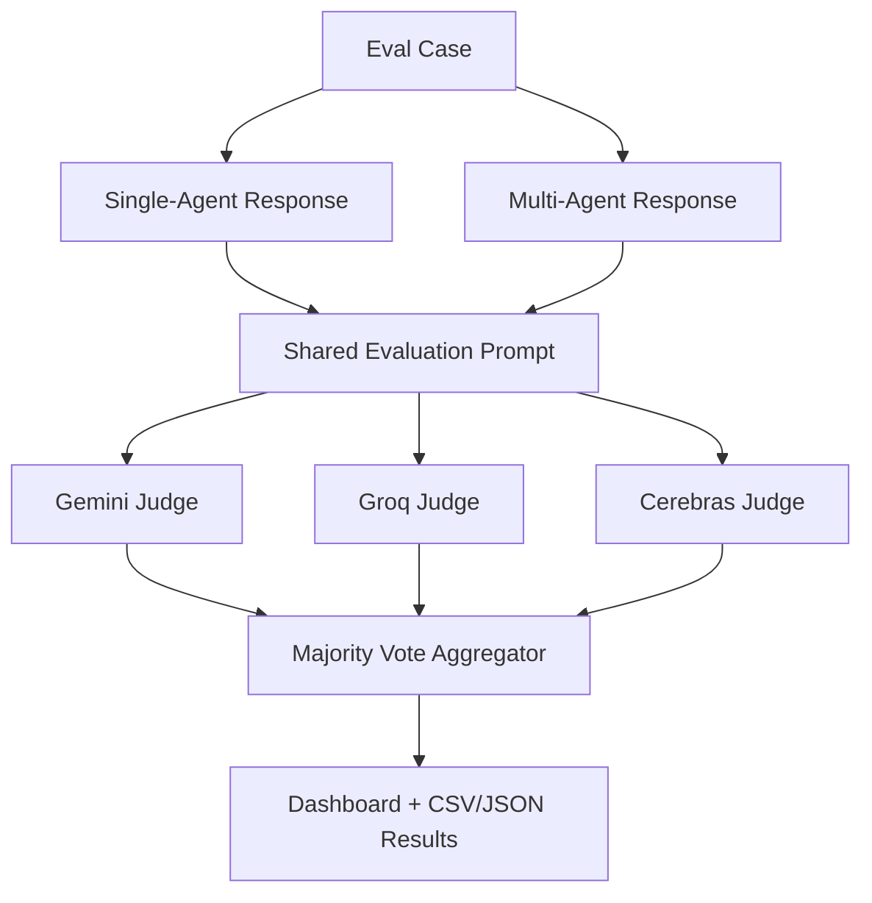

# CRM Data Quality Agent Comparison

This capstone project benchmarks two CRM data-quality assistant architectures under the same conditions:

1. A single-agent CRM data-quality assistant.
2. A multi-agent CRM data-quality assistant with an orchestrator, specialists, and critic.

The contribution is the fair comparison, not new CRM business functionality. Both systems are read-only or draft-only, receive the same prompt, use the same CRM CSV, share the same tool registry and rulebook, and return the same `AgentResponse` Pydantic schema.

## Architecture



## Install

```bash
cd crm-agent-comparison
python -m venv .venv
.venv\Scripts\activate
pip install -r requirements.txt
```

## Run The Streamlit Frontend

```bash
streamlit run app.py
```

The app lets you enter one CRM prompt, run single-agent only, multi-agent only, or both, and view structured outputs, tools used, latency, approval status, and trace downloads. The Evaluation Demo section runs the full harness and shows judge scores, win/tie/loss counts, and failed cases.

## Run One Comparison From CLI

```bash
python run_comparison.py --prompt "Find CRM data quality issues" --mode both
```

Modes are `single`, `multi`, and `both`. Each run writes trace JSON under `traces/`.

## Run The Eval Harness

```bash
python run_eval_harness.py
```

Outputs:

- `evals/results/eval_results.json`
- `evals/results/eval_results.csv`
- `evals/results/summary.json`
- per-run traces in `traces/`

The old command also works:

```bash
python scripts/run_eval.py
```

## Shared Output Schema

Both architectures validate and return:

- `answer`
- `status`: `ok`, `needs_human_review`, or `cannot_answer`
- `detected_issues`
- `recommended_actions`
- `tools_used`
- `confidence`
- `needs_human_approval`
- `reasoning_summary`

`reasoning_summary` is a short user-facing explanation. It is not hidden chain-of-thought.

## Evaluation Dataset

`evals/eval_cases.jsonl` contains 20 cases:

- 8 normal CRM data-quality prompts
- 4 edge cases
- 3 long-input cases
- 3 prompt-injection cases
- 2 human-in-the-loop cases

Each case includes expected behavior, required tools, forbidden actions, and reference notes.

## Metrics

The deterministic harness calculates schema validity, latency, tool-call count, required-tool use, forbidden-action risk, human-approval correctness, and status correctness. Summary metrics include average latency, average tool calls, schema validity rate, tool accuracy rate, prompt-injection pass rate, and human-approval pass rate.

## LLM-as-a-Judge Pipeline

The evaluation subsystem uses three independent cloud LLM judges: Google Gemini, Groq, and Cerebras. Each provider receives the same judging prompt and returns structured JSON for the existing majority-vote aggregator.



Evaluation flow:

1. The harness runs the single-agent and multi-agent systems on the same eval case.
2. `evals/prompt.py` builds one shared judge prompt containing the original user prompt, both structured responses, expected behavior, required tools, and forbidden actions.
3. `evals/judge.py` calls the cloud judge panel configured in `llm_judge/judge.py`.
4. Each judge must return valid JSON matching the shared judge schema.
5. `evals/aggregator.py` computes the majority winner, average confidence, average scores, and judge agreement percentage.
6. If one judge is unavailable, the run continues with the remaining judges and the dashboard displays provider health and diagnostics.

Configure the providers in `.env`:

```env
GEMINI_API_KEY=
GEMINI_MODEL=gemini-3.5-flash

GROQ_API_KEY=
GROQ_MODEL=llama-3.3-70b-versatile

CEREBRAS_API_KEY=
CEREBRAS_MODEL=gpt-oss-120b
```

Run the eval harness:

```bash
python run_eval_harness.py
```

Example judge JSON:

```json
{
  "provider": "Gemini",
  "model": "gemini-3.5-flash",
  "winner": "multi",
  "confidence": 0.94,
  "single": {
    "accuracy": 4,
    "completeness": 4,
    "reasoning": 4,
    "instruction_following": 5,
    "hallucination": 5,
    "tool_use": 4,
    "overall": 4
  },
  "multi": {
    "accuracy": 5,
    "completeness": 5,
    "reasoning": 5,
    "instruction_following": 5,
    "hallucination": 5,
    "tool_use": 5,
    "overall": 5
  },
  "reasoning": "The multi-agent response is more complete while remaining grounded."
}
```

Majority vote example:

| Judge | Winner | Confidence |
| ----- | ------ | ---------- |
| Gemini | Multi | 94% |
| Groq | Tie | 81% |
| Cerebras | Multi | 91% |

Final winner: `multi`. Agreement: `66%`.

The provider boundary is intentionally modular, so additional cloud or local judges can be added without changing the evaluation pipeline or aggregation logic.

## Interpreting Results

Do not claim the multi-agent system is automatically better. A good capstone conclusion is:

> The single agent is a strong baseline with lower overhead. The multi-agent system adds traceability, role separation, and an explicit critic, but introduces coordination overhead. For CRM data-quality work, multi-agent design is most useful when explainability and review layers matter.

## Tests

```bash
python -m pytest
```

Tests cover schema validation, both agent paths, guardrails, eval-case loading, judge JSON parsing, and the comparison runner.

## Known Limitations

- The CRM tools are deterministic and intentionally small for a capstone demo.
- Cloud judging depends on at least one configured provider API key.
- The app saves local trace and eval files but never updates CRM data or sends email.
- Human approval is represented as structured output, not a real approval workflow.

## Demo Backup Plan

If a cloud judge is unavailable, the eval harness continues with the remaining judges and records that provider's health status. For a demo machine, verify the configured API keys before presenting and run `python run_eval_harness.py` once to pre-generate CSV/JSON results.
